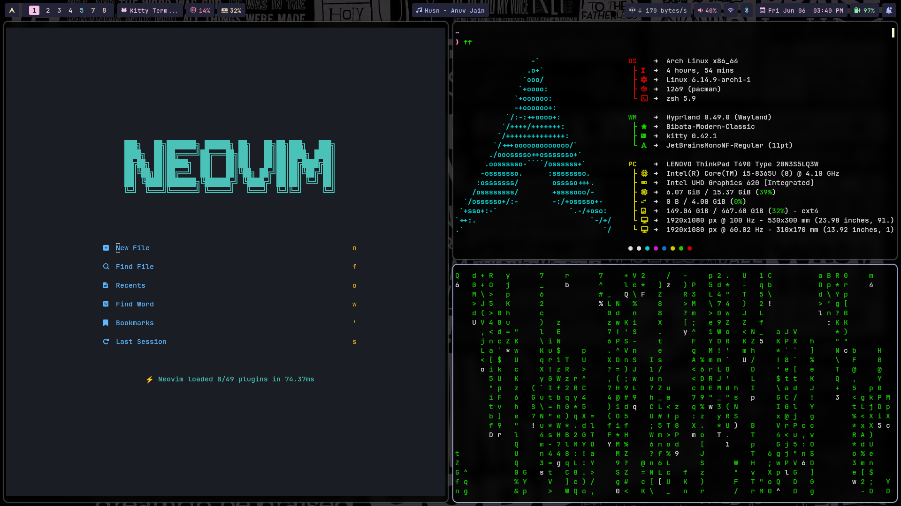

# Hypr-Arch - Modern Arch Linux with Hyprland

A meticulously crafted Arch Linux configuration featuring Hyprland as the window manager, offering a beautiful, minimal, and functional desktop environment that prioritizes both aesthetics and performance.




---

## Features

- **Window Manager**: [Hyprland](https://github.com/hyprwm/Hyprland) - A dynamic tiling Wayland compositor designed for customizability and performance
- **Status Bar**: [HyprPanel](https://hyprpanel.com/) - A sleek, feature-rich panel for Hyprland
- **Terminal**: [Ghostty](https://ghostty.org/) & [Kitty](https://github.com/kovidgoyal/kitty) - Modern GPU-accelerated terminals
- **App Launcher**: [Rofi](https://github.com/in0ni/rofi-wayland) - Customizable application launcher with Wayland support
- **Screen Lock**: [Swaylock Effects](https://github.com/mortie/swaylock-effects) - Secure and stylish screen lock with blur effects
- **Wallpaper Manager**: [Hyprpaper](https://github.com/hyprwm/hyprpaper) - Efficient wallpaper daemon for Hyprland
- **Idle Management**: [Hypridle](https://github.com/hyprwm/hypridle) - Power management and idle actions
- **File Manager**: [Nautilus](https://apps.gnome.org/Nautilus/) & [Yazi](https://github.com/sxyazi/yazi) - Graphical and TUI file managers
- **System Info**: [FastFetch](https://github.com/fastfetch-cli/fastfetch) - A fast system information tool
- **Power Management**: Power Profiles Daemon - Automated power profiles management

---

## Preview

### Full Desktop View


### Individual Components

- **Terminal (Kitty)**:
  

- **Waybar**:
  

- **Wofi**:
  

- **Notifications (Dunst)**:
  

- **Screen Lock (Swaylock)**:
  

---

## Installation

To replicate this setup, follow these steps:

### Prerequisites
- Arch Linux installed and updated.
- Git installed.

### Steps

1. Clone this repository:
   ```bash
   git clone https://github.com/binoymanoj/Hypr-Arch.git
   cd Hypr-Arch/
   ```

2. Make the installation script executable:
   ```bash
   chmod +x install.sh
   ```

3. Run the installation script:
   ```bash
   ./install.sh
   ```

This script will:
- Install required packages.
- Configure Hyprland and its dependencies.
- Set up configuration files in the appropriate directories.

---

## Configuration

### Hyprland
Configuration files are located in `~/.config/hypr`. Custom keybindings, workspace settings, and layouts are defined here.

---

## Screenshots

Screenshots are included in the `./images` directory for reference.

---

## Keybindings

Keybindings are included in keybindings.md file in the root of this repository.

---

## Contributions

Feel free to open issues or submit pull requests to improve this setup.

---

## License

This project is licensed under the MIT License. See the [LICENSE](LICENSE) file for details.

---

## Acknowledgments

- [Arch Wiki](https://wiki.archlinux.org/) for its extensive documentation.
- [Hyprland GitHub](https://github.com/hyprwm/Hyprland) for the incredible window manager.

---

